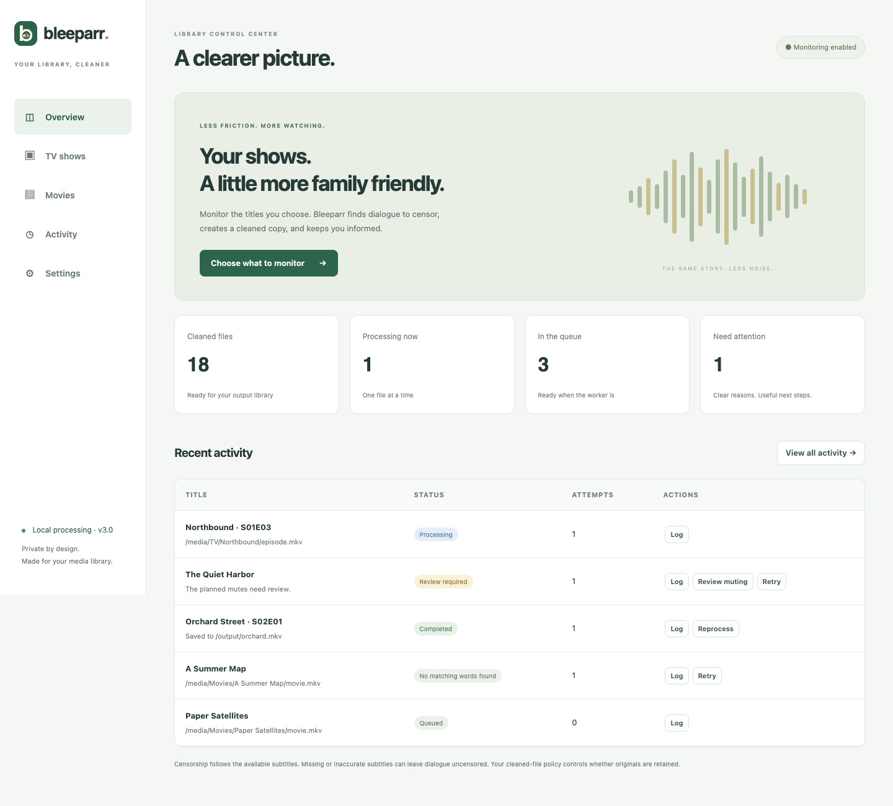
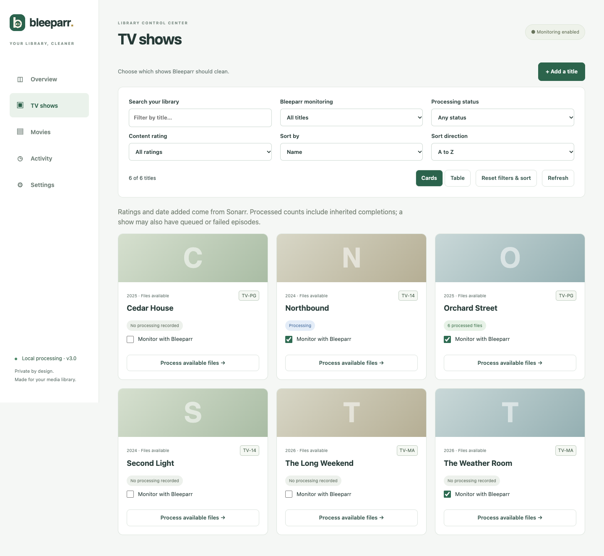
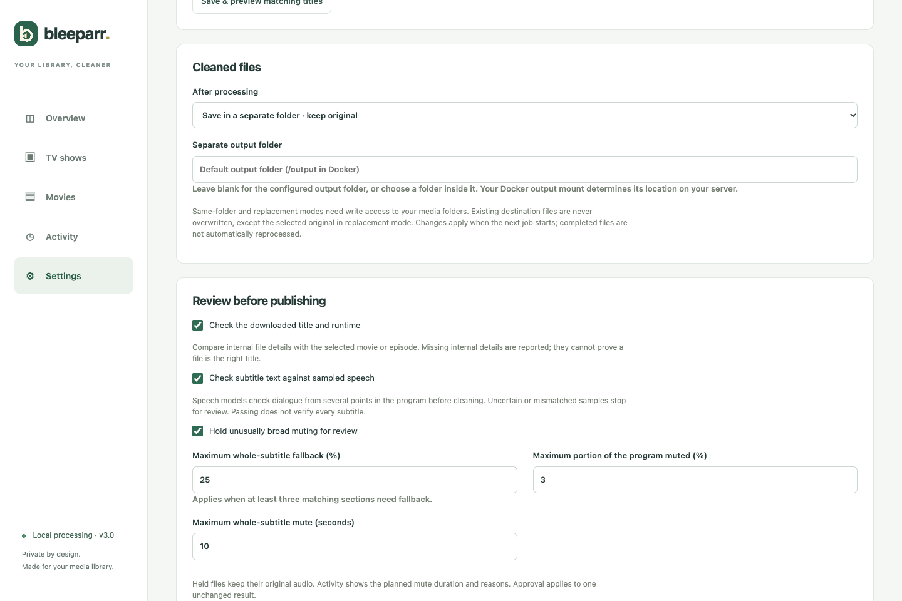
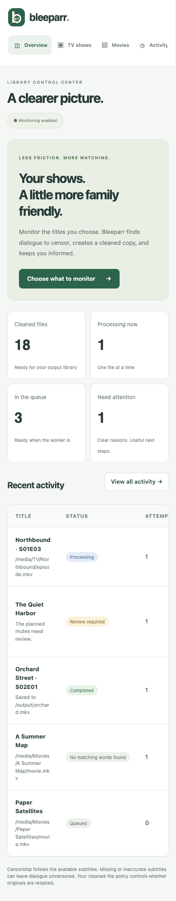
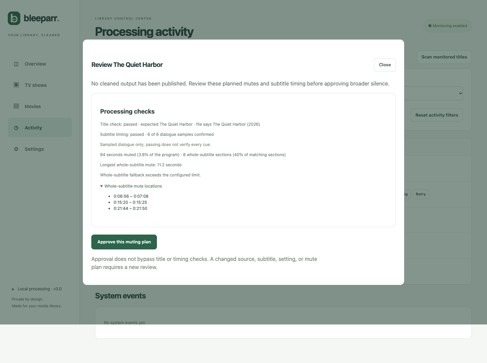

<p align="center">
  
</p>

<h1 align="center">Bleeparr 3.0</h1>
<p align="center"><strong>Your library, cleaner.</strong><br>Local dialogue muting for Sonarr and Radarr, with a web interface and review before risky changes.</p>

Bleeparr finds words and phrases you choose in English subtitles, uses local speech models to locate them in the audio, and creates a validated MKV with those moments muted. You choose which titles to monitor and where the cleaned files go.

**3.0 is a rewrite of the 2.0 web application.** It replaces the old backend and frontend with FastAPI, React, and a persistent SQLite queue. The bundled processing CLI is included as the existing engine; this release does not change the separate CLI project.



## What it does

- Browse TV shows and movies from Sonarr/Radarr; monitor individual titles or configured folders.
- Match configurable words and phrases; use small and medium local speech models for precise mute timing.
- Check English audio, subtitle language, coverage, timing, and available internal title metadata.
- Hold unusually broad muting for review before publishing a cleaned file.
- Validate the full cleaned audio/video before replacing any original.
- Keep temporary originals outside Plex, optionally, for later reprocessing.
- Show queue history, subtitle details, mute statistics, readable failures, and useful recovery actions.
- Optionally update Plex synopsis notes and send SMTP notifications.

**Limits:** subtitles guide detection. Missing or inaccurate subtitles and speech recognition can miss dialogue. This is dialogue muting, not removal of visual content or a guarantee that a program is suitable for every viewer. Known foreign-only audio is skipped; untagged audio is not proof of English. See [quality safeguards](docs/quality-safeguards.md).

## Start with Docker

### You need

- Docker Engine with the Compose plugin on a Linux host, or Docker Desktop for local evaluation.
- A reachable Sonarr and/or Radarr instance and its API key (**Settings → General → Security** in the manager).
- A folder of media visible to Bleeparr and enough space for a complete cleaned copy, working audio clips, and models.
- CPU capacity for local inference. Compose starts with **2 CPUs / 4 GB RAM**, one processing worker, CPU INT8, and two speech threads. Reserve resources for your other services. Processing can take a substantial amount of time.
- Internet access for the initial image build and model download. Recognition then uses cached models offline. Manager, optional subtitle-provider, Plex, and email calls still use their configured networks.

### 1. Download and configure

```sh
git clone https://github.com/davidpeele/bleeparr.git
cd bleeparr
cp .env.example .env
mkdir -p media cleaned originals
```

Edit `.env`:

| Setting | What to enter |
| --- | --- |
| `MEDIA_PATH` | Host folder containing your media; mounted at `/media`. Default `./media`. |
| `OUTPUT_PATH` | Host folder for separate cleaned files; mounted at `/output`. |
| `ORIGINALS_PATH` | Host archive folder outside all Plex/manager libraries; mounted at `/originals`. |
| `BLEEPARR_BIND` | Keep `127.0.0.1` for local access, or use your server's LAN address. |
| `BLEEPARR_TOKEN` | Set a strong, unique access token before allowing LAN access. |
| `SONARR_URL`, `RADARR_URL` | Optional bootstrap URLs; leave blank to configure in the app. |
| `SONARR_API_KEY`, `RADARR_API_KEY` | Optional bootstrap keys; leave blank to configure in the app. |

Do not use your host's `localhost` as a manager URL inside the container. Use a reachable host address or Docker service name on a shared network. Saved app settings take precedence over these bootstrap environment values.

```sh
docker compose up -d --build
```

Open **http://localhost:5050**. On another device, use your configured server address. Enter the Bleeparr access token if prompted. Keep the app behind a trusted network or an authenticated HTTPS reverse proxy; it does not provide individual user accounts.

### 2. Download the local speech models once

With the app idle, run:

```sh
docker compose exec bleeparr python -c "from faster_whisper.utils import download_model; download_model('small.en'); download_model('medium.en')"
```

This is an explicit setup download into the persistent `models` mount. It may take several minutes and requires several gigabytes. In **Settings → Speech-model readiness**, use **Save & check models** to verify both cached models can load, decode audio, and run inference. The check measures runtime compatibility, not recognition accuracy.

### 3. Connect your managers and map paths

In **Settings**, enter Sonarr and/or Radarr URLs and API keys, then **Save & test connection**.

If a manager reports `/srv/library/TV/Example/episode.mkv` while the same file is mounted at `/media/TV/Example/episode.mkv`, map **`/srv/library` → `/media`** for that manager. Both mapping fields are required together. Use manager paths for automatic folder selection, and container paths for Bleeparr file access. See [setup and operations](docs/operations.md).

### 4. Choose titles and a file policy

Edit the starter word list: one word or complete phrase per line. Matching ignores case and punctuation. In **TV shows** or **Movies**, enable **Monitor with Bleeparr** for a title and use **Process available files**. Confirm the first result in **Activity** before enabling automatic queuing.

Automatic queuing is **off by default**. Enabling it scans all available files in selected titles, including files already present; it is not limited to future downloads. New files are deferred for two minutes after modification. Folder-based selection is optional and starts with no folders configured.

| Policy | Where the cleaned file goes | What happens to the original |
| --- | --- | --- |
| **Separate folder** — default | `/output`, with a fingerprint prefix | Kept in the library. |
| **Beside original** | Same media folder, with `(profanity removed)` in the name | Both files remain. Plex may offer both versions. |
| **Replace original** | Same media folder, with `(profanity removed)` in the name | Removed only after full validation and successful publication. |

Compose mounts media **read-only** by default. For beside-original or replacement mode, change `:/media:ro` to `:/media:rw` in `docker-compose.yml`, recreate the container, and confirm filesystem write permissions. Saving a policy cannot grant write access.

For **one playable version in Plex**, use Replace original. Optionally enable **Retain unmuted originals when replacing files**. Copies go to the separate `ORIGINALS_PATH` archive; **do not add that archive to Plex**. Retention starts off; when enabled the suggested defaults are seven days / 100 GB, adjustable in Settings. A full archive holds new replacements rather than deleting unexpired originals. Reprocess can use a verified retained original until it expires. Existing completions are not automatically rerun.

<details>
<summary>More screenshots: library, safeguards, and mobile</summary>





</details>

## Review and recovery



Activity distinguishes cleaned output, **No matching words found**, skipped foreign audio, failures, blocked publication, and review holds. No-match runs retain the original and create no cleaned output or Plex cleaned note.

The default strategy is **S-M-FSM**: small model → medium model for unresolved words → whole-subtitle fallback as a last resort. **S-M** stops when words remain unresolved. **FSM** is explicit subtitle-only muting; the independent timing guard still uses speech models while enabled. Dependency/model errors stop processing and cannot silently turn a run into fallback muting.

Subtitle selection tries language-labelled sidecars, unlabelled sidecars, then embedded full text tracks. Candidates that fail text language, coverage, or enabled timing checks are rejected and selection continues. When **Search online for subtitles when local candidates fail** is enabled (default), Subliminal searches for up to five ranked alternatives using manager title/year/episode metadata and release details. An exact release filename is not required: every downloaded candidate must pass sampled speech/timestamp verification, even when timing checks for local subtitles are disabled. Activity shows candidate rejections and the accepted source. A failed speech runtime stops processing; subtitles are not automatically translated or retimed. Bazarr-downloaded sidecars can be used, but there is no direct Bazarr API integration.

Default broad-muting limits are 25% fallback sections (at least three), 3% of program duration muted, and 10 seconds for a single fallback mute. A hold publishes nothing. Approval is limited to that unchanged source, subtitle, word list, settings, and exact mute plan. It cannot override a title or timing hold.

**Reprocess** previews one manager file and its subtitles before queuing it. An already-muted copy cannot restore its missing audio; use its retained original or obtain a fresh manager download. Invalid-media recovery can request a Sonarr/Radarr search. Automatic searches and verified blocklisting are off by default; local subtitle, speech, permission, and review problems do not trigger download recovery.

## Optional integrations

- **Plex synopsis notes:** enter your Plex server URL/token, test the connection, and select libraries in Settings. Notes apply only to signature-verified completed paths that Plex has indexed. Mixed cleaned/original versions are skipped. Renamed replacements request a Sonarr/Radarr refresh; Plex indexing remains a separate concern.
- **Email:** configure SMTP host, port, TLS mode, sender, recipient, and credentials in Settings. Email is off by default. Certificate verification is enabled for STARTTLS and TLS. Unencrypted mode supports an unauthenticated trusted relay only.
- **Add titles:** search your manager's catalog from the app, select its quality profile and root folder, then add. Download searching on add is optional and off by default.

No cloud speech service, bundled accounts, personal keys, or preconfigured libraries are included. Settings secrets are stored locally in SQLite, hidden in API responses, and preserved when a secret input is left blank. Protect the data directory and avoid sharing raw logs or database backups.

## Upgrade from 2.0

Use a fresh installation directory and stop older Bleeparr monitor scripts before using 3.0 on the same files. The old database is **not automatically migrated**. Reenter connections, path mappings, word lists, and monitored titles. Version 3.0 uses `data/bleeparr-v3.sqlite3` and leaves older databases intact. Do not blindly import old “cleaned” filenames as verified successes.

The [scrubbed 2.0 archive](https://github.com/davidpeele/bleeparr/tree/legacy/v2.0) is retained separately for reference; it is unsupported and is not the recommended installation. See [migration and release notes](docs/migration.md).

## For maintainers, designers, and coding agents

Start with the [technical reference](docs/technical-reference.md). It explains the architecture, dependency choices, data flow, contracts, failure behavior, interface decisions, and invariants to preserve when changing the app.

- [Technical reference](docs/technical-reference.md)
- [Setup, backups, upgrades, and troubleshooting](docs/operations.md)
- [Quality safeguards and their limits](docs/quality-safeguards.md)
- [Contribution and development guide](CONTRIBUTING.md)
- [Security and privacy](SECURITY.md)
- [Changelog](CHANGELOG.md)

The repository includes regression tests for the queue, media publication, speech failures, subtitle checks, retention, integrations, and UI filters. Docker builds the frontend from source. There is no official prebuilt image in this release; use `docker compose up -d --build`.

Screenshots show fictional titles and synthetic results captured from the real interface. They contain no deployment settings or library data.

## License

See [LICENSE](LICENSE). Third-party software and model licenses remain their respective owners' terms; model weights are downloaded separately and are not bundled.
