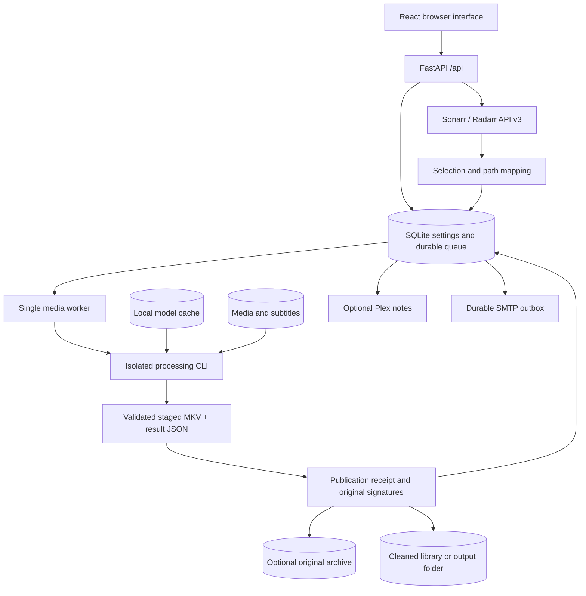
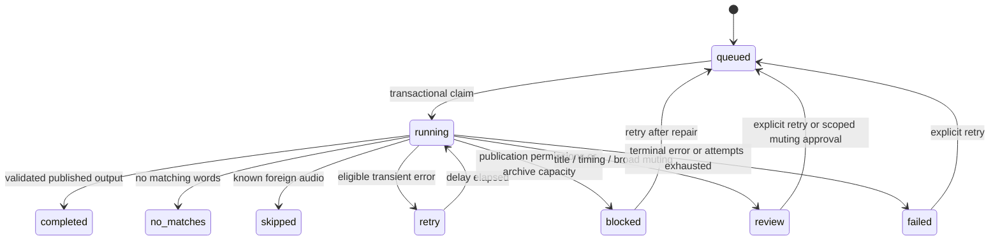

# Bleeparr 3.0 technical reference

This is a maintainer's map of the working web application: what each part owns, why it exists, and which guarantees changes must preserve. Read this before altering queue behavior, media publication, speech dependencies, or integration side effects. It describes the current implementation, not a proposed future architecture.

## Scope and boundaries

The app orchestrates subtitle-guided muting of English dialogue in Sonarr/Radarr libraries. It does not transcribe the entire program to discover everything subtitles omit, censor visual content, certify suitability, or manage downloads independently of the media managers. The web application was rewritten for 3.0; the bundled CLI is the existing processing engine. This release does not modify the separate CLI repository.

## System map

The API and frontend are served by one container and origin. The worker runs in a background thread, launches a CLI subprocess per file, and consumes JSON results. It is deliberately not a distributed worker system.

## Stack and dependency choices

| Component | Implementation | Reason and constraint |
| --- | --- | --- |
| Web API | Python 3.12, FastAPI, Pydantic | Typed input validation; direct access to filesystem and Python integrations. `requirements.txt` defines allowed versions. |
| Browser UI | React 19, Vite 6, plain CSS, ESLint 9 | Small SPA, one origin, no separate production Node server or external asset service. Lockfile records resolved npm packages. |
| Persistent state | Python stdlib SQLite, WAL, transactional writes | One-machine durable settings/queue without Redis or database service. One app instance per data directory. |
| Media | FFmpeg / FFprobe from Debian Bookworm | Probe streams, extract short clips, copy video, encode muted audio, fully decode output to validate. |
| Speech | Faster Whisper **1.2.1**, PyAV **18.1.0**, CTranslate2 **4.8.2** | These exact versions work together. PyAV 19 removed a decoder parameter used by this speech engine. Upgrade as a tested group. |
| Models | Cached `small.en`, `medium.en` | Small first for bounded CPU use, medium only for unresolved evidence. Offline inference; setup downloads are explicit. |
| Subtitles | `srt` 3.5.3, `langid` 1.1.6 | Cue parsing and local text-language checks; tags alone are insufficient. |
| Subtitle discovery | Subliminal, Babelfish | Optional provider search when a suitable local track is absent. Provider availability can change; no guarantee of subtitles. |
| Managers | Requests, Sonarr/Radarr API v3 | Manager metadata owns title identity, library paths, quality profiles, and download actions. |
| Plex | PlexAPI | Optional metadata notes based on exact verified outputs; not a media processing dependency. |
| Email | Python stdlib SMTP / TLS | Optional durable outbox without an external mail wrapper; verified TLS when credentials are used. |
| Container lifecycle | Docker Compose, `tini`, one Uvicorn worker | Signal forwarding and controlled shutdown; preserves worker locks and state. |

Only the speech compatibility group and subtitle parser/detector have exact Python pins; other packages use bounded ranges. The Docker base tags are not digest-locked. Rebuilds can pick up compatible patches. The release does not claim fully reproducible byte-for-byte builds. FFmpeg is a system dependency outside pip. Model files and weights are separate from the source release.

## Module ownership

| Path | Responsibility | Change guidance |
| --- | --- | --- |
| `backend/main.py` | API validation, auth middleware, app lifecycle, SPA delivery | Keep validation and secret redaction at the boundary. |
| `backend/store.py` | Schema, defaults, queue transactions, outcomes | Preserve restart behavior and add safe migrations for existing databases. |
| `backend/service.py` | Manager client, scanning, path mapping, subprocess worker, renamed-file refresh | Do not put publication shortcuts or automatic recovery into the UI. |
| `backend/selection.py` | Manual/folder monitoring and exclusions; manager language metadata | Exclusions override automatic selection; unknown audio is not proven foreign. |
| `backend/catalog.py` | Library presentation from manager metadata and verified history | Presentation must not infer success from a filename. |
| `backend/output.py` | Output plan, signatures, durable receipts, validated publication | This module owns original deletion. Preserve no-clobber and source-change checks. |
| `backend/retention.py` | Opt-in verified archive, capacity, expiry, reprocess source lookup | Never evict an unexpired or changed copy just to make room. |
| `backend/reprocessing.py` | Preview and enqueue one source; archive previous job evidence | A previous delivery receipt must not bypass fresh analysis. |
| `backend/replacement.py` | Verified release match and bounded native failed-download recovery | Only invalid media qualifies; never act on ambiguous history or packs. |
| `backend/plex.py` | Exact output matching, managed notes, retry bookkeeping | Mixed-version items cannot receive a blanket cleaned note. |
| `backend/notifications.py` | Persisted outbox, SMTP transport, delivery history | Email failure must not turn a cleaned media job into failure. |
| `backend/speech_health.py` | Cached-model evidence and isolated offline runtime check | Share inference lock with media worker; consume lazy results. |
| `cli/bleeparr.py` | Subtitle selection/checks, matching, speech refinement, rendering, decode validation | Treat as an engine contract; leave its standalone behavior unchanged in this release. |
| `cli/quality.py` | Identity evidence, sampled alignment, broad-muting plan/token | Reviews happen before rendering and publication. |
| `frontend/src/App.jsx` | Shell, settings, job actions and result details | Action availability mirrors backend rules but never grants authority. |
| `frontend/src/Library.jsx` | Manager library browse, monitoring, filters and sorting | Keep manager monitoring distinct from Bleeparr monitoring. |
| `frontend/src/Activity.jsx` | Job/action filters and events | Counts refer to the latest exposed history, not an unlimited archive. |
| `frontend/src/Quality*.jsx`, `SpeechReadiness.jsx` | Review evidence and model status | Explain uncertainty and next action using familiar language. |
| `scripts/` | Explicit legacy audit/import tools | Read-only audits are separate from reviewed imports; never auto-run them on install. |
| `tests/` and `frontend/tests/` | Regression contracts | Use synthetic media and mocked external services. |

## From selection to publication

1. A user monitors titles or configures folder selection using **manager paths**. Manual selection persists even outside the folder rule; unchecking creates a durable exclusion. Folder matching honors path boundaries.
2. Scans combine manual and automatic selection, query manager files, and skip known foreign-only audio metadata. Shared multi-episode files are queued once. The first representative episode's identity is retained consistently with its queued item ID.
3. Each remote path is mapped to a local path and resolved against allowed `MEDIA_ROOTS`. Missing mappings, traversal, and symlink escapes cannot grant arbitrary file access. Recently modified files wait two minutes.
4. A SHA-256 fingerprint of manager kind, resolved path, size, and modification time deduplicates the source. This is **file identity**, not a whole-media content checksum. Verified output and reviewed legacy signatures prevent rescanning known completions.
5. A transactional claim marks one job running and increments attempts. The worker captures relevant processing settings at job start and writes a word-list snapshot. Later edits do not silently change that job's processing arguments.
6. The app plans a hidden stage in the destination filesystem, then invokes the CLI with explicit output, models, strategy, expected identity, guards, result path, and job workspace. A separate process bounds failure impact and allows group termination on shutdown/timeout.
7. The engine probes input and checks video/audio eligibility; compares usable internal metadata against manager expectations; selects English subtitles; checks text language and coverage; samples subtitle timing; identifies configured matches; refines timestamps through speech models; and checks broad-muting thresholds.
8. A no-match or known-foreign result creates no cleaned file. A review/failure creates no published cleaned file. A successful render copies video, retains subtitles/chapters/metadata, and writes **one selected muted AAC audio track**. Alternate audio tracks and attachments are omitted to avoid leaving an uncensored alternate track. Some subtitle formats require conversion for MKV compatibility.
9. Output duration/stream checks and **full selected audio/video decode** must pass. The source signature must still match. This validates playback, not censorship accuracy.
10. The app records a durable publication receipt. If requested, it verifies an original archive copy using SHA-256 before replacing/deleting anything. Publication uses atomic replacement only for the explicitly selected existing original/recovery target; new destinations use no-clobber hard-link publication on the same filesystem.
11. The receipt allows interrupted publication to resume idempotently. The processed-output signature is registered before publication but counts as cleaned only if the actual file matches. Original deletion follows verified publication; changed files are retained for review.
12. Renamed replacement output requests a manager rescan. Plex notes and notifications track their own delivery outcomes; neither changes successful media processing into failure.

## State and durable evidence

Primary database: `DATA_DIR/bleeparr-v3.sqlite3`. SQLite WAL permits readers during writes. Queue claims and completion transitions use `BEGIN IMMEDIATE` transactions. Startup initializes missing tables/columns/defaults without overwriting existing settings. Legacy databases are not migrated automatically.

| Table group | Purpose |
| --- | --- |
| `settings` | JSON values; includes local secrets. New defaults insert only missing keys. |
| `monitored`, `monitoring_exclusions` | Selected titles and explicit automatic-rule exclusions, keyed by manager kind + ID. |
| `jobs` | Fingerprint, manager IDs/identity, paths, state, attempts, schedule, JSON result. |
| `processed_outputs` | Exact published path + stat signature, not a filename convention. |
| `legacy_completions`, `legacy_recovery_inputs` | Operator-reviewed inherited evidence, invalidated by source change. |
| `original_backups` | Archive source/output links, signatures, sizes, expiry, companion subtitle and state. |
| `searches`, `replacements` | Durable cooldown/reservation and release-recovery evidence. |
| `plex_updates`, `plex_notes` | Retry state and prefixes managed by this app. |
| `notifications` | Durable outbound email and delivery evidence; not SMTP credentials. |
| `events` | Operational messages. |

Per-job files include `worker.log`, `words.txt`, `result.json`, and `delivery.json`. Explicit reprocessing saves older job evidence under `DATA_DIR/audits` and removes previous publication artifacts from the active workspace. Do not discard a receipt merely because the job is retrying: it may describe an output already published.

### Outcomes

Subtitle language/coverage errors are terminal failures with review-oriented explanations; the distinct `review` state is currently used for title, timing, and broad-muting holds. Do not collapse either into success. Retryable codes are limited to missing subtitles, timeout, busy output, changed/missing input, and interruption. Backoff is exponential from `retry_minutes`. Startup moves in-flight jobs to retry. Notifications interrupted after a possible SMTP acceptance become **unknown**, avoiding silent duplicate delivery.

## Safety contracts and heuristics

- **English audio:** foreign-only known metadata is excluded before queueing and actual stream tags are checked in the engine. Unknown/multilingual metadata remains eligible for probing. English subtitles do not make foreign audio eligible.
- **Subtitle source:** English-tagged embedded text subtitles only; forced tracks excluded. A sidecar's name is evidence, not proof; actual text is checked locally. Image subtitles need OCR, which is not implemented.
- **Language:** fewer than 80 tokens, wrong detected language, or detector score below 0.8 require attention. Beginning/middle/end samples can catch mixed-language files. Scores are heuristics, not calibrated probabilities.
- **Coverage:** for programs at least ten minutes long, broad cue/word/coverage/gap checks flag suspiciously incomplete subtitles. Quiet programs can be false positives. See the safeguard guide for numeric thresholds.
- **Identity:** usable internal title aliases must achieve similarity at least 0.65; movie years allow one year difference; expected episode must match the internal episode set; runtime difference over `max(300 seconds, 15%)` holds. Missing/encoder labels are reported unavailable, not accepted as independent identity proof.
- **Timing:** up to six distributed dialogue samples, at least three; content-word agreement at least 0.5 for a sample with timestamps within the cue ±0.75 seconds; two thirds must confirm. No automatic timing correction. A passing sample check does not validate every cue.
- **Speech failures:** decoding/transcription can fail lazily when consuming segment iterators. Always exercise actual inference when upgrading. Runtime exceptions cannot be converted into normal unresolved-word fallback.
- **Broad muting:** app defaults enable review over 25% fallback (at least three sections), 3% duration muted, or a fallback interval over 10 seconds. Merged buffered intervals determine duration. Approval hashes source signature, subtitle content, word list, models, strategy, buffers, limits, and exact ranges. Reanalysis must reproduce the approved plan.
- **Publication:** never infer cleaned status from the output suffix; never delete before validated publication; never clobber an unrelated destination; check source/recovery signatures again immediately before destructive steps.
- **Retention:** opt-in, replacement only; count unregistered/partial files toward capacity; no early eviction; preserve changed archives; active reprocessing pins an expired copy until it finishes. Queue/review states do not indefinitely pin it. Companion subtitles have independent signatures.
- **Recovery:** only verified invalid-media failures qualify for download search/blocklisting. Use unchanged source, current manager file ID/path/size, unique import/grab history, download ID, and bounded reservations. Shared episode packs and ambiguous history are skipped.

## Concurrency, lifecycle, and scaling

Run **one Uvicorn process and one container per data directory**. The lifespan uses a filesystem process lock; media inference uses an in-process lock shared with readiness checks. Scans have their own lock. Email has a separate worker; Plex checks run between jobs. SQLite alone does not make this a safe multi-worker system: inference locks, global stop/wake events, and startup recovery are process-local.

The worker checks stop signals while waiting for the subprocess, terminates its process group, and escalates to kill if needed. Default app job timeout is five hours. Compose allows a 60-second graceful stop. Completed receipts and unfinished stages survive so operators can inspect failures. Increasing web workers or replicas requires a deliberate redesign of ownership, recovery, locking, and resource accounting.

## API contracts

The authoritative typed schema is FastAPI's `/openapi.json`. With a Bleeparr token configured, all `/api/*` routes except `/api/health` require `Authorization: Bearer <token>`. Static frontend assets are public; raw settings secrets are never returned. Mutating requests with a different Origin host are rejected. This is single-token access, not per-user authorization.

| API group | Main operations |
| --- | --- |
| `/api/settings`, `/api/connections/{kind}/test` | Read/save validated settings; test manager access. |
| `/api/library/{kind}`, monitor/queue children | Present library, change Bleeparr monitoring, enqueue manager files. |
| `/api/monitoring/preview`, `/api/scan` | Preview folder rules without that endpoint queueing, or run a scan. |
| `/api/discover/{kind}`, `/api/options/{kind}` | Manager catalog lookup, profiles/roots, explicit add. |
| `/api/status`, `/api/jobs/{id}/log` | Latest 300 jobs, aggregate recent counts, latest 20 events, bounded log tail. |
| Job retry/reprocess/approve-muting | Explicit state changes with current evidence checks. |
| Job search/replacement-preview/replacement | Invalid-media recovery, guarded again on submission. |
| `/api/speech-readiness`, `/api/originals` | Read model/archive evidence; POST readiness only while idle. |
| `/api/plex/*`, `/api/notifications/*` | Connection/sync/test and outbox management. |

Blank secret values preserve saved secrets; connection flags tell the UI a secret exists. Environment manager credentials bootstrap only missing settings. Do not treat a successful HTTP save as proof that manager connectivity, filesystem permissions, or model cache are valid: explicit checks establish those separately.

## Interface and design rationale

The UI uses forest green, warm gold accents, clear spacing, and plain-language actions. It serves administrators managing processing; Plex viewers do not interact with Bleeparr. The generated icon and screenshots are local assets. Fonts fall back to system sans-serif; no remote font fetch is required.

Overview highlights work and attention. Library views support combined title/rating/state/monitoring filters, sorting, and card/table presentation. Activity groups actions with the evidence that makes them eligible. Local browser filters are convenience preferences, not server truth. Desktop and mobile layouts use the same actions and contracts.

Technical logs remain available behind details, while normal flows explain what happened and what to do next. A reviewer sees planned mute duration and timestamps before approving. No-match wording must stay neutral. Retention must say where the archive goes and when it expires. Model readiness must distinguish cache presence, compatibility, stale checks, and recognition accuracy. Maintain semantic controls, focus indicators, labels, responsive scrolling, and text equivalents for status colors.

## Decisions and rejected alternatives

| Decision | Why | Trade-off |
| --- | --- | --- |
| Single durable SQLite queue | Simple local operation and restart evidence | No horizontal scaling; history cleanup is manual. |
| CLI subprocess per file | Failure isolation and stable engine boundary | Startup overhead; result/receipt files are essential contracts. |
| Subtitle-guided speech clips | Focus inference on likely words | Missing subtitle dialogue remains undetected. |
| Small then medium | More precise timing with bounded resources | Slower than whole-cue muting; difficult clips can remain unresolved. |
| Review broad fallback | Prevent surprise silence while allowing explicit decisions | Quiet or difficult programs may need intervention. |
| Copy video, encode one audio track | Avoid unnecessary video quality loss and uncensored alternate audio | AAC re-encoding and loss of alternate audio/attachments. |
| Full decode validation | Detect damaged output before original deletion | Adds significant CPU/I/O time. |
| Opt-in original retention outside libraries | Recovery without exposing two Plex versions in replacement mode | Extra storage/copy cost; expiry can remove the retry source. |
| Explicit manager recovery only for invalid media | Avoid redownloading for local faults | Subtitles/models/config must be repaired locally. |
| No automatic 2.0 history migration | Old success labels cannot establish safe publication | Operators reconfigure or use reviewed import tools. |

## Change checklist for a future engineer or agent

1. Read the relevant owning module and its regression tests; do not rely solely on this reference when code changes.
2. Identify affected contracts: job state, source signature, output receipt, archive, manager history, secret redaction, or UI action eligibility.
3. Keep old database settings compatible. Add missing columns/defaults without silently resetting existing values.
4. For engine changes, preserve CLI JSON fields and classify errors deliberately. Do not treat missing result JSON as success.
5. For dependencies, run the full suite with actual FFmpeg and speech decoder dependencies; a skipped decoder test is not evidence of compatibility.
6. Use synthetic media and mocked services. Run real offline model inference separately when upgrading speech packages; use media read-only for diagnosis.
7. Review partial publication, crash/restart, source change, capacity exhaustion, duplicate action, and multiple-episode behavior.
8. Keep screenshot fixtures and release files free of real settings. Update this reference, operations instructions, and changelog when behavior changes.
9. Deploy only when idle, back up state, and keep a compatible rollback image. Restoring an old database after new outputs have been published can lose important evidence.

Known gaps: OCR/image subtitles, full-audio detection, automatic timeline correction, job cancellation, individual user accounts, multiple instances per manager type, per-episode monitoring overrides, and distributed workers are not implemented. Logs/artifacts and database history need operator retention maintenance. These are boundaries to design explicitly, not functionality to infer from the UI.
